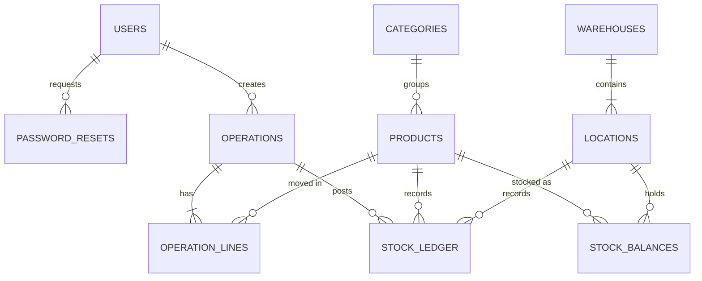
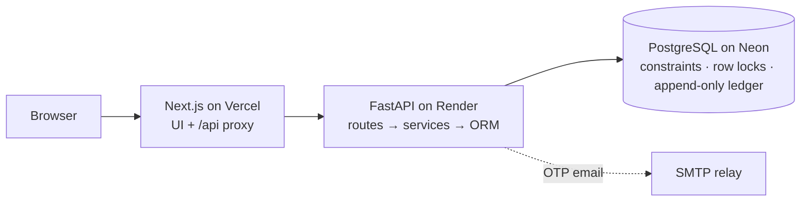

<div align="center">

# StockSense

### Every movement. Accounted for.

A modular, accuracy-first **Inventory Management System** that replaces registers and spreadsheets with one real-time app.<br/>
Receipts, deliveries, transfers and physical counts are validated operations on an append-only PostgreSQL ledger that can prove every number.

<br/>

[](https://stocksense-eosin.vercel.app)
[](https://stocksense-api-vs0b.onrender.com/docs)

[](https://github.com/Harsha-code-per/StockSense/actions/workflows/backend.yml)
[](https://github.com/Harsha-code-per/StockSense/actions/workflows/frontend.yml)


[](LICENSE)

**Odoo Hackathon 2026** · Built by a team of four

[Overview](#overview) · [Live demo](#live-demo) · [Evaluation criteria](#how-stocksense-meets-the-evaluation-criteria) · [Database design](#database-design) · [Architecture](#architecture) · [Getting started](#getting-started) · [Team](#team)

</div>

---

## Overview

Small and mid-size businesses still track stock in registers, Excel sheets and memory. Numbers drift, nobody can explain why a quantity changed, and a stock-out is found when a customer is already waiting.

StockSense is built on one rule:

> **Stock only changes through validated operations.** Every receipt, delivery, internal transfer and physical count is applied in a single database transaction and recorded in an append-only ledger.

So the system can always answer *what do we have, where is it, what is coming in or going out, and why did this number change*. It can also **prove** it: a live integrity check confirms that every balance equals the sum of its recorded movements.

## Live demo

**App:** https://stocksense-eosin.vercel.app &nbsp;·&nbsp; **API (OpenAPI):** https://stocksense-api-vs0b.onrender.com/docs

| Role | Email | Password |
|---|---|---|
| Inventory manager | `manager@stocksense.dev` | `Manager@123` |
| Warehouse staff | `staff@stocksense.dev` | `Staff@123` |

The live database holds two weeks of realistic activity: 3 warehouses, 9 locations, 20 products and about 130 validated operations.

> [!NOTE]
> The API runs on a free tier and sleeps after 15 minutes idle. The first request can take about 50 seconds.

**A two-minute tour**

1. **Dashboard:** KPIs, 14-day activity chart, operation pipeline and the *Ledger reconciled* badge. Filter by document type, status, warehouse and category.
2. **Reorder** a low-stock item in one click: a draft receipt for the suggested quantity opens, ready to validate.
3. **Count next:** *Office Chair* is ranked high risk, with its reasons. Record a count and see the difference before it is posted.
4. **Operations board:** drag a card to *Ready* to check availability, or to *Done* to validate. The motor delivery is refused: there isn't enough stock.
5. **The Steel Rod story** from the problem statement: receive 100 kg, transfer 40, try to deliver 50 (refused), deliver 20, count 17, **77 kg**. **Move history** then explains every step, and exports to CSV.
6. Sign in as **staff** and try to validate an adjustment: only managers can.

## Problem statement coverage

| Module | Delivered |
|---|---|
| **Authentication** | Sign up, log in, logout; OTP password reset by email; redirect to the dashboard; manager and staff roles |
| **Dashboard** | Products in stock, low / out of stock, pending receipts, pending deliveries, scheduled transfers; filters by document type, status, warehouse or location, and category |
| **Products** | Name, SKU, category, unit of measure, optional initial stock; stock per location; categories; reordering rules (min / max) |
| **Receipts** | Supplier and products, quantities received, validate → stock increases |
| **Delivery orders** | Pick and pack (availability check: *Waiting* / *Ready*), validate → stock decreases; overselling is refused |
| **Internal transfers** | Warehouse to production floor, rack to rack, warehouse to warehouse; company total unchanged; every movement in the ledger |
| **Stock adjustments** | Select product and location, enter the counted quantity; the difference is posted and logged |
| **Move history** | Who, when, what, from where to where, balance after; filters and CSV export |
| **Settings** | Multiple warehouses, each with its own locations |
| **Profile** | My profile, logout |
| **Additional features** | Low-stock alerts, multi-warehouse support, SKU search and smart filters on every list |

**Beyond the brief**

| Feature | What it adds |
|---|---|
| **Count next** | Ranks which shelves to count first from movements since the last count, days since the last count and past discrepancies, with reasons in plain language. Rule-based and explainable, not a black box. |
| **One-click reorder** | Turns a low-stock alert into a draft receipt for the suggested quantity. |
| **Operations board** | Kanban of Draft → Waiting → Ready → Done. Drag to confirm or validate, with buttons for keyboard and touch. |
| **Activity charts** | Validated operations per day by type and the open pipeline by stage, with a table view. |
| **Integrity proof** | A live check that every balance equals the sum of its ledger movements. |
| **Idempotent validation** | Validating twice returns the first result and moves nothing. |
| **Cinematic landing page** | WebGL hero and a GSAP scroll story of the Steel Rod example, with full reduced-motion support. |

## How StockSense meets the evaluation criteria

| Criterion | How we address it |
|---|---|
| **Database design** | 11 normalized tables in PostgreSQL. Business rules enforced by the database itself: `CHECK` constraints (no negative stock, valid statuses, which locations each operation type may use), unique references, foreign keys, indexes on every hot filter, and a trigger that makes the ledger append-only. [Details](#database-design) |
| **Real backend, no BaaS** | Our own FastAPI service, schema, migrations, authentication and transactions. PostgreSQL runs in Docker locally and on Neon (plain Postgres) in production. |
| **Minimal third-party APIs** | Own auth, own charts (hand-built SVG), own business logic. The only external service is an SMTP relay for OTP email, and it falls back to the console when not configured. |
| **Real-time, dynamic data** | Every screen reads live data from PostgreSQL through the API. No static JSON; mocks exist only inside tests. |
| **Robust input validation** | Three layers: instant form feedback in the browser (zod), server validation (Pydantic) with field-level messages mapped back onto the form, and database constraints as the last line of defence. |
| **Logic** | One `operation_service` is the only code allowed to change stock: status lifecycle, availability checks, atomic multi-line moves, running balances and Odoo-style references (`WH/IN/0001`). |
| **Modularity** | Thin routes → services that own every transaction → SQLAlchemy models. Frontend split into route groups, shared UI components, a typed API client and feature modules. |
| **Coding standards** | Type hints and strict TypeScript throughout; ruff, ESLint and Prettier enforced in CI; Conventional Commits. |
| **Security** | bcrypt passwords, httpOnly `Secure` session cookie, server-side role checks, hashed one-time codes with expiry and attempt limits, login lockout, no user enumeration, CORS limited to the app's own domain. |
| **Performance** | Server-side pagination on every list, indexed filters, aggregates computed in SQL, eager loading to avoid N+1 queries, pooled connections. |
| **Scalability** | Stateless API; locks live in the database, so they stay correct across multiple instances; locks are taken in a fixed order, so concurrent validations never deadlock. |
| **Usability & front-end design** | One consistent design system and status colour scheme, clear sidebar navigation, loading, empty and error states, toasts that state the stock effect, responsive on desktop, tablet and mobile. |
| **Debugging** | Every response carries an `X-Request-ID` that matches its log line; one standard error format `{code, message, details, field_errors}`; health and integrity endpoints. |
| **CI/CD** | GitHub Actions on every pull request (lint, migrations up / down / up, backend tests, frontend build, browser tests). Protected `main`; every merge deploys automatically to Vercel and Render. |
| **Git as a team sport** | All four members commit from their own accounts on short-lived feature branches merged through pull requests, with file ownership per member (CODEOWNERS) to avoid merge conflicts. |

## Database design



- **Balances plus a ledger.** `stock_balances` holds the current quantity per product and location; `stock_ledger` holds every signed movement with the balance after it. The integrity check proves that the two always agree.
- **Rules in the schema.** `CHECK (quantity >= 0)` on balances, one `CHECK` per operation type for its allowed source and destination, `status = 'done'` if and only if `validated_at` is set, exactly one of quantity or counted quantity per line, and format checks on SKUs and warehouse codes.
- **Append-only history.** A trigger rejects any `UPDATE` or `DELETE` on the ledger. Mistakes are corrected with a new adjustment, never by editing the past.
- **Exact quantities.** `NUMERIC(18,3)` for kilograms and litres, never floating point.
- **Sequential references.** A per-warehouse, per-type counter row, locked on use, generates `WH/IN/0001`, `WH/OUT/0001` and so on inside the same transaction.
- **Migrations.** Alembic, with constraints and the trigger written by hand, and CI applying, rolling back and re-applying every migration.

Every table, column, constraint and index: [docs/DATA_MODEL.md](docs/DATA_MODEL.md)

## Architecture



- **Modular monolith.** One FastAPI service in clear layers; the service layer owns every transaction.
- **Same-origin by design.** The browser only talks to the Next.js app, which proxies `/api/*` to the backend, so the session cookie stays first-party.
- **All or nothing.** Each validation is one transaction with the affected rows locked, so a transfer can never take stock from one place without adding it to the other, and two users can never ship the same last unit.

More: [Architecture](docs/ARCHITECTURE.md) · [Inventory rules](docs/INVENTORY_RULES.md) · [API contract](docs/API.md)

## Tech stack

| Layer | Technology |
|---|---|
| Frontend | Next.js 16 (App Router), React 19, TypeScript, Tailwind CSS 4, react-hook-form + zod |
| Motion & graphics | GSAP, Motion, a hand-written WebGL shader, hand-built SVG charts |
| Backend | FastAPI, Pydantic v2, SQLAlchemy 2, Alembic |
| Database | PostgreSQL 16 (Docker locally, Neon in production) |
| Auth | Own JWT session cookie, bcrypt, email one-time codes |
| Quality | pytest on real PostgreSQL, Playwright, ruff, ESLint, Prettier |
| Delivery | GitHub Actions, Vercel, Render, Neon (all free tiers) |

## Testing and CI/CD

- **76 backend tests** on real PostgreSQL: the full Steel Rod story, every rule in the acceptance matrix, two users racing for the last units (exactly one wins), multi-line transfers that roll back completely, a ledger that rejects edits, and login lockout under parallel attempts.
- **96 browser tests** with Playwright across desktop, tablet and mobile, plus unit tests for the API client and the route guard.
- **On every pull request:** lint and format, migrations up / down / up, backend tests, frontend build and browser tests. Both checks must pass before anything reaches `main`, and every merge deploys automatically.

## Getting started

Prerequisites: Git, Docker, Python 3.12 and Node 24 or newer.

```bash
git clone https://github.com/Harsha-code-per/StockSense.git && cd StockSense
docker compose up -d db                        # PostgreSQL (DB_PORT=5433 if 5432 is taken)

cd backend
python -m venv .venv && source .venv/bin/activate
pip install -r requirements-dev.txt
cp .env.example .env
alembic upgrade head
python -m app.seed_demo --yes                  # two weeks of demo data (or: python -m app.seed)
uvicorn app.main:app --reload                  # http://localhost:8000/docs

cd ../frontend                                 # in a second terminal
npm install && cp .env.example .env.local
npm run dev                                    # http://localhost:3000
```

| Task | Command |
|---|---|
| Backend tests | `cd backend && pytest -q` |
| Backend lint | `ruff check . && ruff format --check .` |
| Frontend checks | `cd frontend && npm run lint && npm test && npm run build` |
| Browser tests | `npm run test:e2e` |

Environment variables and the free deployment setup: [docs/DEPLOYMENT.md](docs/DEPLOYMENT.md)

## Project structure

```text
StockSense/
├── backend/          FastAPI: routes, services (stock engine), models, Alembic migrations, tests
├── frontend/         Next.js: landing, auth, dashboard, products, operations, board, history
├── docs/             Architecture, data model, API contract, inventory rules, deployment, demo
├── .github/          CI workflows, CODEOWNERS, pull request template
├── render.yaml       Backend deployment as code
└── docker-compose.yml
```

## Documentation

| Document | Contents |
|---|---|
| [Architecture](docs/ARCHITECTURE.md) | Layers, request flow, transactions and locking, security, frontend structure |
| [Data model](docs/DATA_MODEL.md) | Every table, constraint, index and trigger, with an ER diagram |
| [API contract](docs/API.md) | All endpoints with examples and error codes |
| [Inventory rules](docs/INVENTORY_RULES.md) | Status lifecycle, stock arithmetic, invariants, validation, roles |
| [Deployment](docs/DEPLOYMENT.md) | Local setup, CI/CD, Vercel + Render + Neon |
| [Demo guide](docs/DEMO.md) | Demo script, demo data, acceptance tests |
| [Team plan](docs/TEAM_PLAN.md) | Roles, file ownership and how we worked |
| [Roadmap](docs/ROADMAP.md) | What shipped, assumptions, what comes next |
| [Contributing](CONTRIBUTING.md) | Branches, commits, pull requests, code style |

## Team

| Member | Focus | GitHub |
|---|---|---|
| **Harshavardhan K** | Backend, database and stock engine; deployment and CI; auth pages, dashboard insights and landing page | [@Harsha-code-per](https://github.com/Harsha-code-per) |
| **Loktrishal K** | Frontend foundation and design system; products, warehouses, motion and end-to-end tests | [@loktrishal-05](https://github.com/loktrishal-05) |
| **Sanjjith B** | Operations: receipts, deliveries, transfers and adjustments | [@Sanjjith27](https://github.com/Sanjjith27) |
| **Cholan Abhaynadh Kinnera** | Authentication and dashboard APIs; dashboard, move history and profile; QA | [@Cholan-kinnera](https://github.com/Cholan-kinnera) |

## License

[MIT](LICENSE) © 2026 StockSense Team
