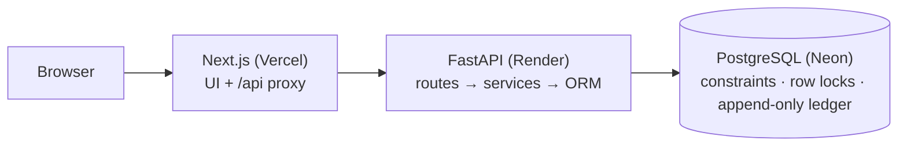

# StockSense

**An accuracy-first Inventory Management System.** It replaces paper registers and scattered Excel sheets with one real-time app, where every stock change is a validated operation with a permanent audit trail.

[](LICENSE)


> 🔗 **Live demo:** _coming soon_ · **API docs (live):** https://stocksense-api-vs0b.onrender.com/docs
> _Free tier: the API sleeps after 15 min idle, so the first request can take ~50 s._
> Built for the Odoo Hackathon (7-hour round).

---

## The problem
Businesses track stock in registers, spreadsheets and people's heads. Numbers drift from reality, nobody can say *why* a quantity changed, and managers find out about stockouts too late.

## Our approach
StockSense is built around one rule:

> **Stock only changes through validated operations: receipts, deliveries, internal transfers and adjustments. Each one is applied atomically and recorded in an append-only ledger.**

So at any moment the app can answer: *What do we have? Where is it? What is coming in or going out? Why did this number change?*

## Features
| | |
|---|---|
| 🔐 **Auth** | Signup / login, OTP-based password reset, account lockout after repeated failures, manager & staff roles |
| 📊 **Dashboard** | Products in stock, low / out-of-stock, pending receipts & deliveries, scheduled transfers; filters by document type, status, warehouse/location, category |
| 📦 **Products** | SKU, category, unit of measure, initial stock, stock per location, reordering rules (min/max) with suggested order quantity |
| 📥 **Receipts** | Incoming goods from vendors → stock increases on validation |
| 📤 **Deliveries** | Outgoing goods → availability check (Waiting/Ready) → stock decreases on validation |
| 🔁 **Internal transfers** | Rack → rack, warehouse → warehouse, total stock unchanged |
| 🧮 **Adjustments** | Enter the physical count; the system logs the difference |
| 📜 **Move history** | Append-only stock ledger: who, when, what, from where to where, balance after |
| 🏭 **Multi-warehouse** | Warehouses with locations (racks, floors, zones) |
| 🔎 **Search & alerts** | SKU/name search, smart filters, low-stock badges |
| ✅ **Integrity check** | Proves ledger totals equal current balances for every product-location |

Odoo-style references (`WH/IN/0001`, `WH/OUT/0001`, `WH/INT/0001`, `WH/ADJ/0001`) and statuses (Draft → Waiting / Ready → Done, or Canceled).

## Why it's trustworthy
- **Atomic operations:** one database transaction per validation. A transfer can never decrease the source without increasing the destination.
- **Concurrency-safe:** PostgreSQL row locks, so two people can't ship the same last unit.
- **Idempotent:** double-clicking *Validate* never moves stock twice.
- **Enforced by the database:** `CHECK (quantity >= 0)`, shape constraints per operation type, and a trigger that makes the ledger append-only.
- **Validated twice:** instant form feedback (zod) plus server validation (Pydantic) with field-level messages.

## Tech stack
| Layer | Technology |
|---|---|
| Frontend | Next.js (App Router), TypeScript, Tailwind CSS, shadcn/ui, react-hook-form, zod |
| Backend | FastAPI, Pydantic v2, SQLAlchemy 2, Alembic |
| Database | PostgreSQL 16 |
| Auth | Own JWT in httpOnly cookie, bcrypt, email OTP via SMTP |
| CI/CD | GitHub Actions → Vercel (frontend) + Render (backend) + Neon (Postgres), all on free tiers |

**No Backend-as-a-Service.** The schema, business logic, authentication and transactions are all ours. Inventory correctness *is* the problem, so we need full control of the database transaction.

## Architecture



Details: [docs/ARCHITECTURE.md](docs/ARCHITECTURE.md)

## Quick start

Prerequisites: Git, Docker, Python 3.12, Node 20+.

```bash
git clone <repo-url> && cd StockSense
docker compose up -d db                      # PostgreSQL 16

cd backend
python -m venv .venv && source .venv/bin/activate
pip install -r requirements-dev.txt
cp .env.example .env
alembic upgrade head && python -m app.seed
uvicorn app.main:app --reload                # http://localhost:8000/docs

cd ../frontend                               # in a second terminal
npm install && cp .env.example .env.local
npm run dev                                  # http://localhost:3000
```

**Demo login:** `manager@stocksense.dev` / `Manager@123` · `staff@stocksense.dev` / `Staff@123`

Full setup, environment variables and deployment: [docs/DEPLOYMENT.md](docs/DEPLOYMENT.md)

## Repository structure
```text
StockSense/
├── backend/            FastAPI app, models, services, Alembic migrations, tests
├── frontend/           Next.js app (App Router)
├── docs/               Architecture, data model, API contract, rules, plans
├── .github/            CODEOWNERS, PR template, CI workflow
├── docker-compose.yml  Local PostgreSQL
└── LICENSE
```

## Documentation
| Doc | What's inside |
|---|---|
| [ARCHITECTURE](docs/ARCHITECTURE.md) | Layers, request flow, transactions & locking, security, frontend structure, UI conventions |
| [DATA_MODEL](docs/DATA_MODEL.md) | Every table, constraint, index and trigger; ER diagram |
| [API](docs/API.md) | Frozen REST contract with request/response examples and error codes |
| [INVENTORY_RULES](docs/INVENTORY_RULES.md) | State machine, stock formulas, invariants, validation rules, roles |
| [TEAM_PLAN](docs/TEAM_PLAN.md) | Who owns what, 7-hour timeline, checkpoints |
| [DEPLOYMENT](docs/DEPLOYMENT.md) | Local setup, CI, free deployment on Vercel + Render + Neon |
| [DEMO](docs/DEMO.md) | Demo script, seed data, acceptance tests, judge Q&A |
| [ROADMAP](docs/ROADMAP.md) | P0/P1/P2 scope, assumptions, open questions |
| [CONTRIBUTING](CONTRIBUTING.md) | Branching, commits, PRs, code style |

## Team
| Member | Role | GitHub |
|---|---|---|
| Member 1 | Backend, database & inventory engine | [@Harsha-code-per](https://github.com/Harsha-code-per) |
| Member 2 | Frontend shell, products & warehouses, deployment | @member2-github |
| Member 3 | Operations UI (receipts, deliveries, transfers, adjustments) | [@Sanjjith27](https://github.com/Sanjjith27) |
| Member 4 | Auth, dashboard, move history, QA & demo | @member4-github |

## License
[MIT](LICENSE) © 2026 StockSense Team
