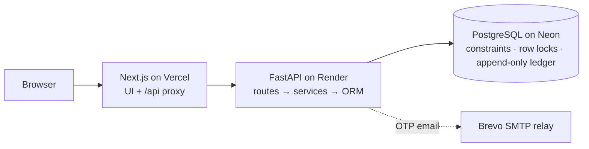

<div align="center">

# StockSense

**Every movement. Accounted for.**

An accuracy-first inventory management system: receipts, deliveries, transfers and physical counts as validated operations, with an append-only ledger that can prove every number.

[**Live app**](https://stocksense-eosin.vercel.app) · [**API docs**](https://stocksense-api-vs0b.onrender.com/docs) · [**Documentation**](#documentation)

[](https://github.com/Harsha-code-per/StockSense/actions/workflows/backend.yml)
[](https://github.com/Harsha-code-per/StockSense/actions/workflows/frontend.yml)
[](LICENSE)


Built by a team of four for the **Odoo Hackathon 2026**.

</div>

---

## Why StockSense

Most small and mid-size businesses still run stock on registers, spreadsheets and memory. The numbers drift, nobody can say *why* a quantity changed, and a stock-out is discovered when a customer is already waiting.

StockSense is built on one rule:

> **Stock only changes through validated operations.** Every receipt, delivery, internal transfer and physical count is applied in a single database transaction and written to an append-only ledger.

So at any moment the system can answer: *What do we have? Where is it? What is coming in or going out? Why did this number change?* And it can **prove** the answer: a live integrity check confirms that every balance equals the sum of its recorded movements.

## Try it in two minutes

Open **https://stocksense-eosin.vercel.app** and sign in:

| Role | Email | Password |
|---|---|---|
| Manager | `manager@stocksense.dev` | `Manager@123` |
| Staff | `staff@stocksense.dev` | `Staff@123` |

The live database holds two weeks of realistic activity (3 warehouses, 20 products, about 130 validated operations). Things to try:

1. **Dashboard:** KPIs, a 14-day activity chart, the operation pipeline and the *Ledger reconciled ✓* badge. Filter by warehouse, category, type or status.
2. **Reorder** a low-stock item in one click: a draft receipt for the suggested quantity opens, ready to validate.
3. **Count next:** *Office Chair* is ranked **high risk**, with its reasons. Click *Record count*, enter a number and watch the difference preview.
4. **Operations board:** drag a card to *Ready* to check availability, or to *Done* to validate it. Try validating the motor delivery: it is refused because there isn't enough stock.
5. **The Steel Rod story:** receive 100 kg → transfer 40 → try to deliver 50 (refused) → deliver 20 → count 17 → **77 kg**. Then open **Move history** to see every step explained, and export it as CSV.
6. Sign in as **staff** and try to validate an adjustment: only managers can.

> The API runs on a free tier and sleeps after 15 minutes idle, so the first request can take about 50 seconds.

## Features

**Everything the problem statement asks for**

| Area | What you get |
|---|---|
| **Authentication** | Sign up and log in; password reset with a 6-digit code sent by email; lockout after repeated failures; manager and staff roles |
| **Dashboard** | Products in stock, low and out of stock, pending receipts and deliveries, scheduled transfers; filters by document type, status, warehouse and category |
| **Products** | SKU, category (created inline), unit of measure, opening stock, stock per location, and reordering rules (min / max) with a suggested order quantity |
| **Receipts** | Goods from vendors: create, validate, stock rises |
| **Delivery orders** | Availability check (*Waiting* / *Ready*) before anything leaves; overselling is refused |
| **Internal transfers** | Rack to rack or warehouse to warehouse; the company total never changes |
| **Stock adjustments** | Enter the physical count and see the difference before it is posted |
| **Move history** | Who, when, what, from where to where, and the balance after; filters and CSV export |
| **Settings** | Multiple warehouses, each with its own locations (racks, floors, zones) |
| **Search & alerts** | SKU and name search, smart filters on every list, low-stock alerts |

**Beyond the brief**

| Feature | Why it matters |
|---|---|
| **Count next** | Ranks which shelves to count first using movements since the last count, days since the last count and past count discrepancies, and shows the reasons in plain language. Explainable, not a black box. |
| **One-click reorder** | Turns a low-stock alert into a draft receipt for the suggested quantity. |
| **Operations board** | A Kanban of Draft → Waiting → Ready → Done. Drag to confirm or validate; buttons cover keyboard and touch. |
| **Activity charts** | Validated operations per day by type, with hover detail and a table view; the open pipeline by stage. |
| **Integrity proof** | A live check that every balance equals the sum of its ledger movements. |
| **Cinematic landing page** | WebGL hero and a scroll-driven story (GSAP) that walks through the Steel Rod example, with full reduced-motion support. |
| **Odoo-style documents** | References such as `WH/IN/0001`; statuses Draft → Waiting / Ready → Done. |

## Why the numbers can be trusted

Correctness is enforced in layers, down to the database itself:

- **All or nothing.** Each validation is one PostgreSQL transaction. A transfer can never decrease the source without increasing the destination.
- **Safe under concurrency.** Operation and balance rows are locked in a fixed order, so two people can't ship the same last unit and the database never deadlocks.
- **Double clicks are harmless.** Validating an operation twice returns the original result and moves nothing.
- **The database has the last word.** `CHECK (quantity >= 0)`, a per-type rule for which locations an operation may use, unique references, and a trigger that makes the ledger **append-only**.
- **Validated twice.** Instant form feedback in the browser (zod) and server validation (Pydantic), with field-level messages.
- **Secure by default.** bcrypt passwords, an httpOnly `Secure` session cookie, server-side role checks, hashed one-time codes with expiry and attempt limits, no user enumeration, and CORS limited to the app's own domain.

## Architecture



- **Modular monolith.** One FastAPI service with clear layers: thin routes, a service layer that owns every transaction, and SQLAlchemy models. A single `operation_service` is the only code allowed to change stock.
- **Same-origin by design.** The browser only talks to the Next.js app, which proxies `/api/*` to the backend, so the session cookie stays first-party.
- **No backend-as-a-service.** The schema, business rules, authentication and transactions are all our own code.

Details: [Architecture](docs/ARCHITECTURE.md) · [Data model](docs/DATA_MODEL.md) · [Inventory rules](docs/INVENTORY_RULES.md) · [API contract](docs/API.md)

## Tech stack

| Layer | Technology |
|---|---|
| Frontend | Next.js 16 (App Router), React 19, TypeScript, Tailwind CSS 4, react-hook-form + zod, sonner |
| Motion & graphics | GSAP (ScrollTrigger, SplitText), Motion, a hand-written WebGL shader, hand-built SVG charts |
| Backend | FastAPI, Pydantic v2, SQLAlchemy 2, Alembic |
| Database | PostgreSQL (Neon in production, Docker locally) |
| Auth & email | Own JWT session cookie, bcrypt, one-time codes by email (Brevo SMTP relay) |
| Quality | pytest on real PostgreSQL, Playwright, ruff, ESLint, strict TypeScript |
| Delivery | GitHub Actions → Vercel (frontend) + Render (backend) + Neon (database), all on free tiers |

## Quality

- **76 backend tests** run against real PostgreSQL, including:
  - the full Steel Rod story and every rule in the acceptance matrix;
  - two users racing for the last units (exactly one wins);
  - multi-line transfers that roll back completely;
  - a ledger that rejects edits, and the login lockout under parallel attempts.
- **96 browser tests** (desktop, tablet and mobile) with Playwright, plus unit tests for the API client and the redirect guard.
- **CI on every pull request:**
  - lint and format;
  - migrations applied, rolled back and re-applied;
  - backend tests, frontend build and browser tests.
- **Protected `main`:** changes land only through pull requests with both checks green, and every merge deploys automatically.

## Getting started

Prerequisites: Git, Docker, Python 3.12 and Node 24 or newer.

```bash
git clone https://github.com/Harsha-code-per/StockSense.git && cd StockSense
docker compose up -d db                        # PostgreSQL (DB_PORT=5433 if 5432 is taken)

cd backend
python -m venv .venv && source .venv/bin/activate
pip install -r requirements-dev.txt
cp .env.example .env
alembic upgrade head
python -m app.seed_demo --yes                  # two weeks of demo data (or: python -m app.seed)
uvicorn app.main:app --reload                  # http://localhost:8000/docs

cd ../frontend                                 # in a second terminal
npm install && cp .env.example .env.local
npm run dev                                    # http://localhost:3000
```

| Task | Command |
|---|---|
| Backend tests | `cd backend && pytest -q` |
| Backend lint | `ruff check . && ruff format --check .` |
| Frontend checks | `cd frontend && npm run lint && npm test && npm run build` |
| Browser tests | `npm run test:e2e` |

Environment variables and the free deployment setup: [Deployment](docs/DEPLOYMENT.md).

## Project structure

```text
StockSense/
├── backend/        FastAPI app: routes, services (stock engine), models, Alembic migrations, tests
├── frontend/       Next.js app: landing, auth, dashboard, products, operations, board, history
├── docs/           Architecture, data model, API contract, inventory rules, deployment, demo
├── .github/        CI workflows, CODEOWNERS, pull request template
├── render.yaml     Backend deployment as code (Render Blueprint)
└── docker-compose.yml
```

## Documentation

| Document | Contents |
|---|---|
| [Architecture](docs/ARCHITECTURE.md) | Layers, request flow, transactions and locking, security, frontend structure |
| [Data model](docs/DATA_MODEL.md) | Every table, constraint, index and trigger, with an ER diagram |
| [API contract](docs/API.md) | All endpoints with request and response examples and error codes |
| [Inventory rules](docs/INVENTORY_RULES.md) | Status lifecycle, stock arithmetic, invariants, validation rules, roles |
| [Deployment](docs/DEPLOYMENT.md) | Local setup, CI/CD and the free Vercel + Render + Neon setup |
| [Demo guide](docs/DEMO.md) | Demo script, demo data, acceptance tests |
| [Team](docs/TEAM_PLAN.md) | Who built what, ownership, and how we worked |
| [Roadmap](docs/ROADMAP.md) | What shipped, assumptions, and what comes next |
| [Contributing](CONTRIBUTING.md) | Branches, commits, pull requests and code style |

## Team

| Member | Focus | GitHub |
|---|---|---|
| Harshavardhan K | Backend, database and stock engine; deployment and CI; auth pages, dashboard insights and landing page | [@Harsha-code-per](https://github.com/Harsha-code-per) |
| Loktrishal K | Frontend foundation and design system; products, warehouses, motion and end-to-end tests | [@loktrishal-05](https://github.com/loktrishal-05) |
| Sanjjith B | Operations: receipts, deliveries, transfers and adjustments | [@Sanjjith27](https://github.com/Sanjjith27) |
| Cholan Abhaynadh Kinnera | Authentication and dashboard APIs; dashboard, move history and profile; QA | [@Cholan-kinnera](https://github.com/Cholan-kinnera) |

## License

[MIT](LICENSE) © 2026 StockSense Team
