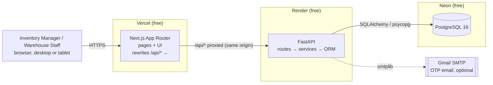
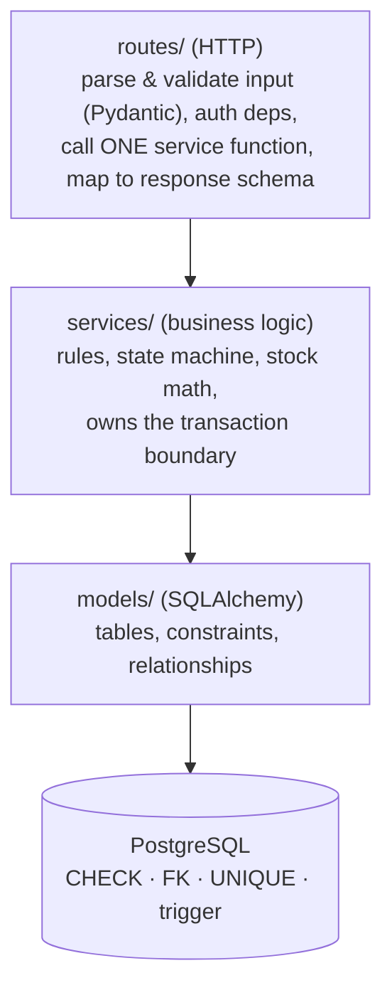
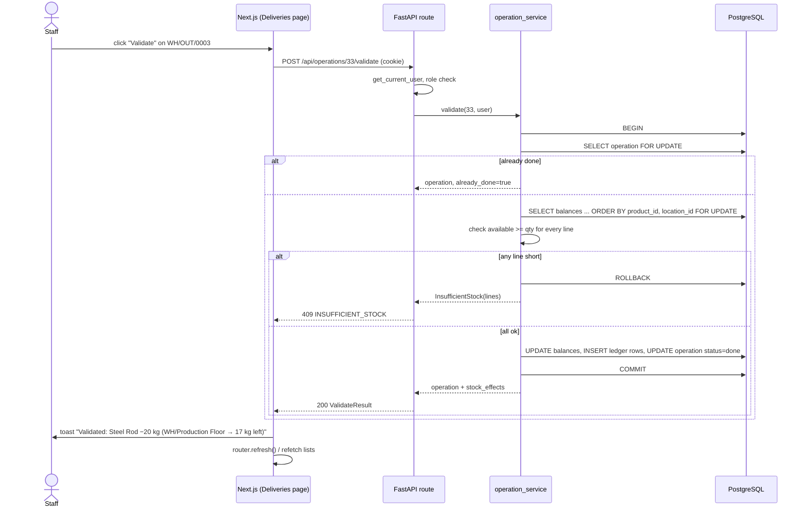

# Architecture

> Owner: **Member 1**. Related: [DATA_MODEL](DATA_MODEL.md) · [API](API.md) · [INVENTORY_RULES](INVENTORY_RULES.md) · [DEPLOYMENT](DEPLOYMENT.md)

## 1. The idea in one line

StockSense is not a set of CRUD screens. It is a **controlled stock-movement engine** with screens on top: receipts, deliveries, transfers and adjustments are the *only* way stock changes. Each one is validated and applied atomically, and each leaves an append-only ledger trail. Dashboards, alerts and reports are read-only views of that trusted state.

## 2. System overview



Local development is the same shape: `next dev` on :3000 → FastAPI on :8000 → Postgres in Docker on :5432.

**Why this shape**
- **Own backend + real relational DB.** The guidelines reject BaaS (Firebase/Supabase/MongoDB); all business rules, auth and schema are ours.
- **Modular monolith, not microservices.** One FastAPI service with clear internal modules. Nothing in the problem (scale, team count, integrations) justifies network hops between services, and a monolith keeps transactions simple (one DB transaction per operation).
- **Next.js rewrites** make the browser see one origin, so the session cookie is first-party and needs no CORS or third-party-cookie workarounds.

## 3. Backend layers



| Layer | Allowed to | Not allowed to |
|---|---|---|
| `routes/` | Validate request, read current user, call a service, return a schema | Touch `stock_balances`; contain business `if`s; open transactions |
| `services/` | Enforce rules, run transactions, raise `DomainError` subclasses | Know about HTTP (no `HTTPException`, no `Request`) |
| `models/` | Declare tables and DB-level constraints | Contain business logic |
| DB | Last line of defense: `CHECK (quantity >= 0)`, shape CHECKs, append-only trigger | — |

`operation_service.validate()` is **the only code path that writes `stock_balances` and `stock_ledger`**.

### Backend module map

```text
backend/
├── app/
│   ├── main.py              # app factory, middleware, exception handlers, ALL routers registered (M1)
│   ├── config.py            # pydantic-settings: DATABASE_URL, JWT_SECRET, SMTP_*, ... (M1)
│   ├── database.py          # engine, SessionLocal, get_db dependency (M1)
│   ├── deps.py              # get_current_user, require_role("manager") (M1)
│   ├── errors.py            # DomainError hierarchy → error JSON (M1)
│   ├── security.py          # bcrypt, JWT encode/decode, session cookie helpers (M1; used by M4)
│   ├── enums.py             # roles, UOMs, operation types/statuses, shared by CHECKs + schemas (M1)
│   ├── models/              # SQLAlchemy models, one file per aggregate (M1)
│   ├── schemas/             # Pydantic request/response models (M1; auth/dashboard schemas M4)
│   ├── services/
│   │   ├── product_service.py      (M1)
│   │   ├── warehouse_service.py    (M1)
│   │   ├── inventory_service.py    (M1) balances, availability, integrity
│   │   ├── operation_service.py    (M1) create/confirm/validate/cancel, THE stock engine
│   │   ├── auth_service.py         (M4) signup/login/JWT/OTP
│   │   ├── email_service.py        (M4) smtplib, console fallback
│   │   └── dashboard_service.py    (M4) aggregate queries
│   ├── routes/              # one router per module; auth.py & dashboard.py are M4
│   └── seed.py              # demo data: python -m app.seed (M1)
├── alembic/                 # migrations (M1 only)
├── tests/                   # pytest: unit + Steel Rod scenario (M1; auth tests M4)
├── requirements.txt
└── .env.example
```

## 4. Request flow: validating a delivery



## 5. Correctness under failure

| Threat | Mechanism |
|---|---|
| Partial transfer (source decreased, destination not) | Single transaction per validate; any exception → rollback |
| Double click / network retry on validate | `SELECT … FOR UPDATE` on the operation + `done` guard → second call returns `already_done: true` |
| Two users consuming the same stock | Balance rows locked `FOR UPDATE` in sorted key order (no deadlocks); availability re-read under the lock |
| App bug writes negative stock | `CHECK (quantity >= 0)` aborts the transaction |
| Someone edits history | Append-only trigger on `stock_ledger`; no update/delete endpoints |
| Drift between balances and ledger | `GET /api/inventory/integrity` recomputes Σ deltas; shown on the dashboard |
| Duplicate reference numbers | `operation_sequences` row-locked counter + `UNIQUE(reference)` |

"Real-time" in this prototype means: once a validate commits, every subsequent read (lists, dashboard, product stock) reflects it immediately because everything reads from the same tables. No cached counters exist that could drift. WebSockets are not needed for the stated problem.

## 6. Frontend architecture

- **Next.js App Router + TypeScript.** File-based routes, so each page is its own folder and there is no shared route-registry file for members to conflict on.
- **Tailwind + shadcn/ui** for one consistent design system (buttons, inputs, dialogs, tables, badges, toasts via `sonner`).
- **react-hook-form + zod** for every form: instant inline errors, then server `field_errors` mapped onto the same fields.
- **Data fetching:** client components call `/api/...` through `lib/api.ts` (one `fetch` wrapper: JSON, credentials, error-shape parsing → throws `ApiError {code, message, field_errors}`). After a mutation: toast + refetch.
- **Route protection:** `src/middleware.ts` (named `proxy.ts` on Next.js 16) redirects to `/login` when the `ss_session` cookie is absent. The API still enforces auth on every call.

```text
frontend/src/
├── app/
│   ├── (auth)/login/  signup/  forgot-password/            (M4)
│   ├── (app)/layout.tsx          # sidebar + header shell  (M2)
│   ├── (app)/dashboard/                                    (M4)
│   ├── (app)/products/  products/[id]/                     (M2)
│   ├── (app)/operations/receipts/  deliveries/  transfers/  adjustments/   (M3)
│   ├── (app)/history/                                      (M4)
│   ├── (app)/warehouses/                                   (M2)
│   └── (app)/profile/                                      (M4)
├── components/ui/          # shadcn primitives              (M2)
├── components/layout/      # Sidebar, Header, PageHeader    (M2)
├── components/operations/  # OperationForm, LineEditor, StatusBadge (M3)
├── lib/api.ts  lib/types.ts                                 (M2)
├── lib/operations.ts                                        (M3)
└── middleware.ts                                            (M4)
```

### UI conventions (consistency is judged)
- Layout: left sidebar (Dashboard, Products, Operations ▸ Receipts/Deliveries/Transfers/Adjustments, Move History, Warehouses, Profile/Logout) + top header with page title and user menu.
- Colors: indigo primary; status badges **Draft gray · Waiting amber · Ready blue · Done green · Canceled red**; stock badges **In stock green · Low amber · Out red**.
- Every list: search box, filters, pagination, empty state, loading skeleton.
- Every mutation: disabled button while pending, success toast that states the effect ("Stock +100 kg at WH/Stock"), error toast + inline field errors.
- Destructive actions (cancel, validate adjustment) use a confirmation dialog that shows the effect (system 20 → counted 17 = −3 kg).
- Forms for delivery/transfer/adjustment show **Available: N uom** next to each line.
- Responsive down to tablet width; tables scroll horizontally inside their card, never the page.

## 7. Security

| Area | Control |
|---|---|
| Passwords | bcrypt (`app/security.py`), min 8 chars with a letter and a digit; never logged |
| Session | JWT (HS256, `JWT_SECRET` from env, 8 h expiry) in httpOnly, `SameSite=Lax`, `Secure` (prod) cookie; not readable by JS (XSS can't steal it) |
| CSRF | SameSite=Lax + JSON-only mutation endpoints (forms can't forge `application/json`); same-origin via rewrites |
| Brute force | 5 failed logins → 15-min lock; OTP max 5 attempts, 10-min expiry, stored hashed; forgot-password never reveals whether an email exists |
| Authorization | Checked server-side via `require_role` dependency; UI hiding is cosmetic only |
| Injection | SQLAlchemy parameterized queries only; no string-built SQL |
| Input | Pydantic schemas with strict types, length limits, regex for SKU/code; decimals capped at 3 places |
| Secrets | Only in env vars (`.env` git-ignored, `.env.example` committed without values) |
| Errors | 500s return a generic message + `request_id`; stack traces only in server logs |

## 8. Observability & debugging

- **Request ID middleware:** every request gets `X-Request-ID` (generated or propagated), included in logs and in 500 error bodies.
- **Structured logging** (stdlib `logging`, one line per request: method, path, status, duration ms, user id, request id). Render and Vercel show these logs for free.
- **Global exception handlers:** `DomainError` → its HTTP code + error JSON; `RequestValidationError` → `VALIDATION_ERROR` with `field_errors`; anything else → `INTERNAL_ERROR` + logged traceback.
- **`/api/health`** checks DB connectivity (used by Render health checks and the pre-demo warm-up).

## 9. Performance & scalability

- Indexes on every filter/sort column (see [DATA_MODEL](DATA_MODEL.md)).
- All lists paginated server-side; the dashboard is computed with aggregate SQL (`COUNT … FILTER (WHERE …)`), never by loading rows into Python.
- N+1 avoided with `selectinload` on operation lines / product categories.
- Connection pooling: SQLAlchemy pool locally; Neon's pooled connection string in production.
- Scaling path (documented, not built): more FastAPI workers behind the same Postgres; read replicas for reporting; move the optional risk-score job to a background worker. Row-level locking already works across multiple app instances because the locks live in Postgres, not in Python.

## 10. Decisions log

| Decision | Chosen | Rejected | Reason |
|---|---|---|---|
| DB | PostgreSQL | SQLite, MongoDB, Firebase/Supabase | Guidelines; row locks, CHECK, triggers, NUMERIC |
| Architecture | Modular monolith | Microservices | Atomic transactions, 7-hour scope |
| Frontend | Next.js App Router | React + Vite | Team choice; file-based routing reduces merge conflicts; free Vercel deploy |
| Auth | Own JWT cookie + bcrypt + OTP | Auth0/Clerk/Supabase Auth | No third-party auth; shows security skills |
| Ledger | One row per location affected | One row with from/to | Integrity check is one `GROUP BY`; running `balance_after` per location |
| Enums | VARCHAR + CHECK | Native PG enum | Painless Alembic migrations |
| AI | Not in core; optional rule-based count-risk score | ML/LLM chatbot | Guidelines: only if it adds real value |
