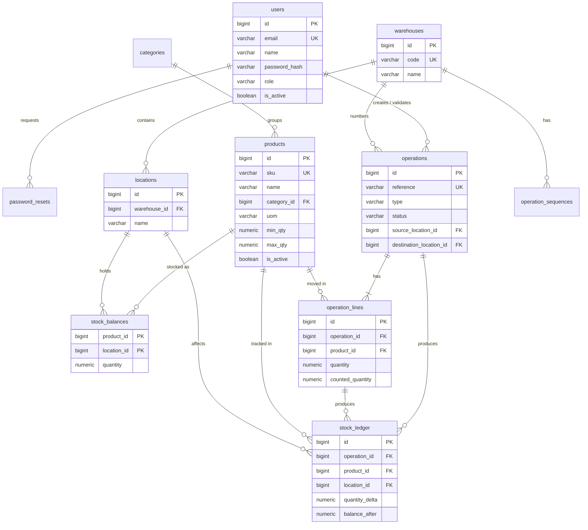

# Data Model

> Owner: **Member 1**. Only Member 1 edits `backend/app/models/` and `backend/alembic/`.
> Everyone else reads this file as the source of truth for field names.

Database: **PostgreSQL 16** (local via Docker, deployed on Neon free tier).
ORM: SQLAlchemy 2.x, migrations with Alembic.

## Design principles

1. **Stock only changes through operations.** No screen, import or script updates `stock_balances` directly. Every change is written by the operation service in the same transaction as a `stock_ledger` row.
2. **The ledger is append-only.** A database trigger rejects `UPDATE`/`DELETE` on `stock_ledger`. Corrections are new operations (adjustments), never edits.
3. **Integrity lives in the database, not only in Python.** `CHECK`, `UNIQUE`, `FOREIGN KEY` and `NOT NULL` constraints encode the business rules below, so a bug in app code cannot silently corrupt stock.
4. **Quantities are exact decimals.** `NUMERIC(18,3)`, never floats (kg / litres need fractions; floats drift).
5. **Deactivate, don't delete.** Products, warehouses and locations referenced by history get `is_active = false`.
6. **Enums as `VARCHAR + CHECK`**, not native Postgres enums (Alembic handles native enum changes badly; a CHECK is one-line to change).
7. **All timestamps are `TIMESTAMPTZ`** (UTC in the DB; the UI localizes them).

## Entity-relationship diagram



## Tables

Conventions: every table has `id BIGINT GENERATED ALWAYS AS IDENTITY PRIMARY KEY` unless noted, plus `created_at TIMESTAMPTZ NOT NULL DEFAULT now()`. Mutable master-data tables also have `updated_at`.

### `users`
| Column | Type | Constraints / notes |
|---|---|---|
| email | VARCHAR(254) | NOT NULL; unique index on `lower(email)` |
| name | VARCHAR(120) | NOT NULL |
| password_hash | VARCHAR(255) | NOT NULL; bcrypt. Plain passwords are never stored or logged |
| role | VARCHAR(20) | NOT NULL DEFAULT `'staff'`; CHECK in (`manager`, `staff`) |
| is_active | BOOLEAN | NOT NULL DEFAULT true |
| failed_login_count | INTEGER | NOT NULL DEFAULT 0 |
| locked_until | TIMESTAMPTZ | NULL; set for 15 min after 5 failed logins |
| updated_at | TIMESTAMPTZ | NOT NULL DEFAULT now() |

### `password_resets`
OTP-based password reset (owned functionally by Member 4, table by Member 1).

| Column | Type | Constraints / notes |
|---|---|---|
| user_id | BIGINT | NOT NULL FK → users ON DELETE CASCADE |
| otp_hash | VARCHAR(255) | NOT NULL; bcrypt of the 6-digit OTP (the raw OTP is never stored) |
| expires_at | TIMESTAMPTZ | NOT NULL; created_at + 10 min |
| attempts | INTEGER | NOT NULL DEFAULT 0; reset is refused after 5 |
| used_at | TIMESTAMPTZ | NULL; set when consumed. Issuing a new OTP invalidates older unused ones |

Index: `(user_id, created_at DESC)`.

### `categories`
| Column | Type | Constraints / notes |
|---|---|---|
| name | VARCHAR(80) | NOT NULL; unique index on `lower(name)` |

### `products`
| Column | Type | Constraints / notes |
|---|---|---|
| sku | VARCHAR(40) | NOT NULL UNIQUE; stored upper-case; CHECK `sku ~ '^[A-Z0-9][A-Z0-9_-]*$'` |
| name | VARCHAR(160) | NOT NULL |
| category_id | BIGINT | NULL FK → categories ON DELETE SET NULL |
| uom | VARCHAR(20) | NOT NULL; CHECK in (`unit`, `kg`, `g`, `l`, `ml`, `m`, `box`) |
| min_qty | NUMERIC(18,3) | NOT NULL DEFAULT 0; CHECK `min_qty >= 0` (reorder point) |
| max_qty | NUMERIC(18,3) | NOT NULL DEFAULT 0; CHECK `max_qty >= min_qty` (reorder target) |
| description | TEXT | NULL |
| is_active | BOOLEAN | NOT NULL DEFAULT true |
| updated_at | TIMESTAMPTZ | NOT NULL DEFAULT now() |

Indexes: `sku` (unique), `lower(name)`, `category_id`.

> **Initial stock**: when a product is created with `initial_quantity`, the service creates and validates an adjustment operation. Opening stock therefore has ledger evidence like everything else.

### `warehouses`
| Column | Type | Constraints / notes |
|---|---|---|
| code | VARCHAR(5) | NOT NULL UNIQUE; CHECK `code ~ '^[A-Z0-9]{2,5}$'`; used in references (`WH/IN/0001`) |
| name | VARCHAR(120) | NOT NULL |
| address | TEXT | NULL |
| is_active | BOOLEAN | NOT NULL DEFAULT true |
| updated_at | TIMESTAMPTZ | NOT NULL DEFAULT now() |

### `locations`
A place stock can sit: a rack, bin, shelf, zone or production floor inside a warehouse.

| Column | Type | Constraints / notes |
|---|---|---|
| warehouse_id | BIGINT | NOT NULL FK → warehouses ON DELETE RESTRICT |
| name | VARCHAR(80) | NOT NULL; UNIQUE (`warehouse_id`, `name`) |
| is_active | BOOLEAN | NOT NULL DEFAULT true |
| updated_at | TIMESTAMPTZ | NOT NULL DEFAULT now() |

Display name is computed as `"{warehouse.code}/{location.name}"`, e.g. `WH/Rack A`.
A location with a non-zero balance cannot be deactivated (service check).

### `stock_balances`
Current on-hand quantity per product per location. **Written only by the operation service.**

| Column | Type | Constraints / notes |
|---|---|---|
| product_id | BIGINT | NOT NULL FK → products ON DELETE RESTRICT |
| location_id | BIGINT | NOT NULL FK → locations ON DELETE RESTRICT |
| quantity | NUMERIC(18,3) | NOT NULL DEFAULT 0; **CHECK `quantity >= 0`** (no negative stock, even if app code has a bug) |
| updated_at | TIMESTAMPTZ | NOT NULL DEFAULT now() |

Primary key: (`product_id`, `location_id`). Extra index: `location_id`. No surrogate `id`.

### `operations`
One document: a receipt, delivery, internal transfer or adjustment.

| Column | Type | Constraints / notes |
|---|---|---|
| reference | VARCHAR(30) | NOT NULL UNIQUE; e.g. `WH/IN/0007` (see [INVENTORY_RULES](INVENTORY_RULES.md#reference-numbering)) |
| type | VARCHAR(12) | NOT NULL; CHECK in (`receipt`, `delivery`, `transfer`, `adjustment`) |
| status | VARCHAR(10) | NOT NULL DEFAULT `'draft'`; CHECK in (`draft`, `waiting`, `ready`, `done`, `canceled`) |
| warehouse_id | BIGINT | NOT NULL FK → warehouses (numbering + filtering) |
| source_location_id | BIGINT | NULL FK → locations |
| destination_location_id | BIGINT | NULL FK → locations |
| partner_name | VARCHAR(160) | NULL; supplier (receipt) or customer (delivery) |
| scheduled_date | DATE | NULL |
| notes | TEXT | NULL |
| created_by | BIGINT | NOT NULL FK → users |
| validated_by | BIGINT | NULL FK → users |
| validated_at | TIMESTAMPTZ | NULL |
| canceled_at | TIMESTAMPTZ | NULL |
| updated_at | TIMESTAMPTZ | NOT NULL DEFAULT now() |

Location-shape constraint (one CHECK, named `ck_operations_locations_by_type`):

| type | source_location_id | destination_location_id |
|---|---|---|
| receipt | NULL | NOT NULL |
| delivery | NOT NULL | NULL |
| transfer | NOT NULL | NOT NULL, and ≠ source |
| adjustment | NOT NULL (the counted location) | NULL |

Also: CHECK `(status = 'done') = (validated_at IS NOT NULL)`.

Indexes: `(type, status)`, `(warehouse_id, status)`, `created_at DESC`, `source_location_id`, `destination_location_id`.

### `operation_lines`
| Column | Type | Constraints / notes |
|---|---|---|
| operation_id | BIGINT | NOT NULL FK → operations ON DELETE CASCADE |
| product_id | BIGINT | NOT NULL FK → products |
| quantity | NUMERIC(18,3) | NULL; CHECK `quantity > 0`. Used by receipt / delivery / transfer |
| counted_quantity | NUMERIC(18,3) | NULL; CHECK `counted_quantity >= 0`. Used by adjustment |
| system_quantity | NUMERIC(18,3) | NULL; snapshot of the balance at validation time (adjustments), for the audit trail |

Constraints: UNIQUE (`operation_id`, `product_id`); CHECK `(quantity IS NULL) <> (counted_quantity IS NULL)` (exactly one of them is set).

### `operation_sequences`
Per-warehouse, per-type reference counter. Incremented with `UPDATE … SET next_value = next_value + 1 RETURNING next_value - 1`, which takes a row lock, so two users never get the same number.

| Column | Type | Constraints / notes |
|---|---|---|
| warehouse_id | BIGINT | FK → warehouses; PK part |
| type | VARCHAR(12) | PK part; same CHECK as `operations.type` |
| next_value | INTEGER | NOT NULL DEFAULT 1 |

No `id` and no `created_at`.

### `stock_ledger`
**Append-only evidence of every stock change.** One row per (line × location affected):
a transfer line writes **two** rows (−Q at source, +Q at destination); receipts, deliveries and adjustments write one.

| Column | Type | Constraints / notes |
|---|---|---|
| operation_id | BIGINT | NOT NULL FK → operations |
| operation_line_id | BIGINT | NOT NULL FK → operation_lines |
| product_id | BIGINT | NOT NULL FK → products |
| location_id | BIGINT | NOT NULL FK → locations (the location whose balance changed) |
| counterpart_location_id | BIGINT | NULL FK → locations (other side of a transfer, for display "from → to") |
| movement_type | VARCHAR(12) | NOT NULL; same values as `operations.type` |
| quantity_delta | NUMERIC(18,3) | NOT NULL; CHECK `quantity_delta <> 0`; signed |
| balance_after | NUMERIC(18,3) | NOT NULL; CHECK `balance_after >= 0`; running balance at that location |
| created_by | BIGINT | NOT NULL FK → users |

Indexes: `(product_id, created_at)`, `(location_id, created_at)`, `operation_id`.

Append-only trigger (created in the first Alembic migration):

```sql
CREATE FUNCTION forbid_ledger_mutation() RETURNS trigger AS $$
BEGIN
  RAISE EXCEPTION 'stock_ledger is append-only (op=%)', TG_OP;
END;
$$ LANGUAGE plpgsql;

CREATE TRIGGER stock_ledger_append_only
BEFORE UPDATE OR DELETE ON stock_ledger
FOR EACH ROW EXECUTE FUNCTION forbid_ledger_mutation();
```

### Integrity invariant (checked by `GET /api/inventory/integrity`)

```sql
-- Must return zero rows.
SELECT b.product_id, b.location_id, b.quantity, COALESCE(SUM(l.quantity_delta), 0) AS ledger_sum
FROM stock_balances b
LEFT JOIN stock_ledger l USING (product_id, location_id)
GROUP BY b.product_id, b.location_id, b.quantity
HAVING b.quantity <> COALESCE(SUM(l.quantity_delta), 0);
```

This is why the ledger stores one row per location: the invariant becomes a single `GROUP BY`.

## Why no separate `cycle_counts` table?
A physical count *is* an adjustment operation: `counted_quantity`, `system_quantity` snapshot, actor, time and location are already on `operations` / `operation_lines`. "Last counted" for any product-location is `MAX(validated_at)` of its adjustments. The optional risk score (P2) reads these rows, so no duplicate data.

## Migration policy
- The **first migration** creates everything above, including CHECKs, indexes and the trigger. Hand-review autogenerate output: Alembic does not detect CHECK constraints or triggers, so they are written explicitly with `op.create_check_constraint` / `op.execute`.
- **Only Member 1 creates migrations**, which avoids Alembic "multiple heads" conflicts between branches.
- Need a new column? Ask Member 1, who adds it to the model and a new migration in one commit.
- Local reset: `docker compose down -v && docker compose up -d db && alembic upgrade head && python -m app.seed`.

## SQLite → PostgreSQL note
The research report proposed SQLite for speed. The Odoo guidelines value a real database (PostgreSQL/MySQL), and Postgres gives us row-level locks (`SELECT … FOR UPDATE`), real `NUMERIC`, CHECK constraints on shape, and plpgsql triggers. These are exactly the features the inventory engine relies on. Docker makes local setup a single command, so the speed argument for SQLite no longer applies.
