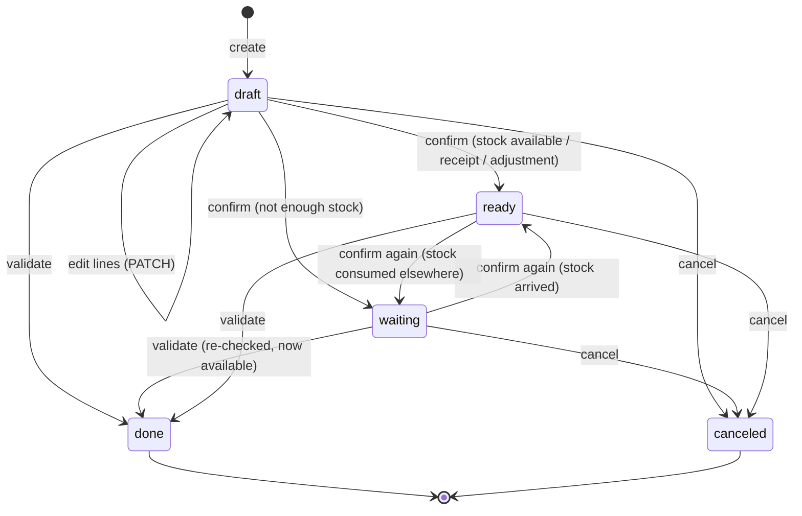

# Inventory Rules

> Owner: **Member 1**. This is the business logic implemented in
> `backend/app/services/operation_service.py` and `inventory_service.py`.
> The frontend **never** does stock arithmetic. It only displays what the API returns.

## Core rule

> If an operation succeeds, stock balances, operation status and ledger rows are all updated **in one database transaction**. If anything fails, **nothing** changes.

## Operation types

| Type | Real-world meaning | Prefix | Locations |
|---|---|---|---|
| `receipt` | Goods arrive from a vendor | `IN` | destination |
| `delivery` | Goods leave for a customer | `OUT` | source |
| `transfer` | Move stock inside the company (rack → rack, warehouse → warehouse) | `INT` | source + destination (different) |
| `adjustment` | Physical count differs from recorded stock | `ADJ` | source (the counted location) |

## Status lifecycle



| Status | Meaning | Changes stock? | Allowed actions |
|---|---|---|---|
| `draft` | Being prepared, editable | No | edit, confirm, validate, cancel |
| `waiting` | Confirmed but not enough stock at source | No | confirm (re-check), validate (re-checks), cancel |
| `ready` | Confirmed, stock available ("picked & packed") | No | validate, cancel |
| `done` | Stock impact applied **exactly once** | Already applied | view only |
| `canceled` | Will never execute | No | view only |

- **Confirm** answers "can this be done right now?" Receipts and adjustments always go to `ready`. Deliveries and transfers go to `ready` only if every line has enough stock at the source, else `waiting`. This gives the PDF's *Waiting / Ready* filters real meaning and maps the PDF's *Pick → Pack → Validate* onto *confirm → validate*.
- **Validate** is allowed from `draft`, `waiting` or `ready` (one-click "Validate" in the UI) and **always re-checks availability inside the transaction**. A `ready` status is a hint, not a guarantee.
- **Done is final.** Mistakes are corrected with a new adjustment (or, P2, a return operation), never by editing or canceling a done operation.
- Only `draft` operations can be edited.

## Stock arithmetic

Let `B(p, l)` be the balance of product `p` at location `l` (missing row = 0).

### Receipt
```
B(p, dest) += Q
ledger: (dest, +Q, balance_after)
```

### Delivery
```
require B(p, src) >= Q            else INSUFFICIENT_STOCK
B(p, src) -= Q
ledger: (src, -Q, balance_after)
```

### Transfer
```
require src != dest               else SAME_LOCATION
require B(p, src) >= Q            else INSUFFICIENT_STOCK
B(p, src)  -= Q
B(p, dest) += Q
ledger: (src, -Q, counterpart=dest), (dest, +Q, counterpart=src)
organization total for p is unchanged
```

### Adjustment (physical count)
```
system  = B(p, loc)               snapshot into line.system_quantity
delta   = counted - system
B(p, loc) = counted
ledger: (loc, delta)  only if delta != 0
```
An adjustment **sets** stock to the counted value. It is not an arbitrary "+/−" screen. The UI shows `system`, `counted` and `difference` before confirming.

## Invariants (tested)

1. A receipt never decreases stock; a delivery never increases it.
2. No balance is ever negative (service check **and** `CHECK (quantity >= 0)`).
3. A transfer preserves each product's organization-wide total.
4. A `done` operation is never applied twice.
5. For every (product, location): `balance == Σ ledger.quantity_delta` (exposed as `GET /api/inventory/integrity`).
6. Every ledger row points to an operation and a line; the ledger is append-only (DB trigger).

## Validate algorithm (reference implementation)

```text
validate(operation_id, user):
  BEGIN
    op = SELECT * FROM operations WHERE id = :id FOR UPDATE      -- serializes double-clicks
    if op is missing              -> NOT_FOUND
    if op.status == 'done'        -> COMMIT; return op (idempotent, no second effect)
    if op.status == 'canceled'    -> INVALID_STATE
    authorize(user, op)           -> FORBIDDEN (adjustments = manager only)
    require op has >= 1 line      -> VALIDATION_ERROR
    require all products active   -> VALIDATION_ERROR

    keys = every (product_id, location_id) the op touches, SORTED     -- deadlock-free order
    INSERT missing balance rows with quantity 0 (ON CONFLICT DO NOTHING)
    SELECT ... FROM stock_balances WHERE (product_id, location_id) IN keys
      ORDER BY product_id, location_id FOR UPDATE

    for line in op.lines:
      apply formula for op.type (above); collect INSUFFICIENT_STOCK errors for ALL lines
    if any errors -> ROLLBACK; return 409 with every failing line in details

    write stock_balances, stock_ledger rows
    op.status = 'done'; op.validated_by = user; op.validated_at = now()
  COMMIT
  return op + stock_effects[]
```

Concurrency: two users delivering the last 10 units at the same moment. The second transaction blocks on `FOR UPDATE`, then re-reads the balance (now 0) and gets `INSUFFICIENT_STOCK`. The `CHECK (quantity >= 0)` constraint is the final safety net.

## Reference numbering

Format: `{warehouse.code}/{PREFIX}/{NNNN}`, e.g. `WH/IN/0001`, `WH/OUT/0012`, `WH2/INT/0003`, `WH/ADJ/0002`.

- The number comes from `operation_sequences` for (warehouse, type), incremented under a row lock, so it is unique and sequential per warehouse and type.
- The warehouse is the destination's warehouse for receipts and the source's warehouse for every other type.
- Assigned at **creation** (drafts get numbers too, like Odoo), so references are stable for conversations ("check WH/OUT/0012").

## Low stock and reordering rules

Per product: `min_qty` (reorder point) and `max_qty` (reorder target).

```
on_hand(p)      = Σ B(p, l) over active locations (optionally filtered by warehouse)
out_of_stock    = on_hand == 0
low_stock       = 0 < on_hand < min_qty
suggested_order = max(max_qty - on_hand, 0)   when low or out of stock
```

Shown as badges on Products, a list on the Dashboard, and KPI counts. Products with `min_qty = 0` are never "low", only "out of stock".

## Validation catalogue

The server enforces all rules; the frontend repeats the obvious ones for instant feedback.

| Area | Rules |
|---|---|
| Signup | name 2–120 chars; valid email; unique email (case-insensitive); password ≥ 8 chars with at least one letter and one digit; confirm password matches |
| Login | email + password required; generic "Invalid email or password" (no user enumeration); 5 failures → locked 15 min |
| OTP reset | 6 digits; expires in 10 min; max 5 attempts; one active OTP per user; `forgot-password` always returns 200 (no enumeration) |
| Product | SKU required, 1–40 chars `[A-Z0-9_-]`, unique; name required; uom in list; `min_qty ≥ 0`; `max_qty ≥ min_qty`; `initial_quantity ≥ 0` requires `initial_location_id` |
| Warehouse | code 2–5 uppercase alphanumerics, unique; name required |
| Location | name required, unique within its warehouse; cannot deactivate with stock |
| Operation (all) | ≥ 1 line; no duplicate product per operation; products active; locations active; location shape per type (see DATA_MODEL) |
| Receipt / Delivery / Transfer line | `quantity > 0`, at most 3 decimals |
| Transfer | source ≠ destination |
| Adjustment line | `counted_quantity ≥ 0`, at most 3 decimals |
| Status | edit only in `draft`; validate from `draft`/`waiting`/`ready`; cancel only before `done` |

## Roles

| Action | staff | manager |
|---|---|---|
| View everything | ✅ | ✅ |
| Create / confirm / validate / cancel receipts, deliveries, transfers | ✅ | ✅ |
| Create adjustment (draft) | ✅ | ✅ |
| **Validate adjustment** | ❌ | ✅ |
| Create / edit products, categories, warehouses, locations | ❌ | ✅ |

Signup creates `staff`; the seed creates one `manager`. Roles are enforced in the API (`require_role("manager")` dependency). Hiding a button in the UI is only cosmetic.
